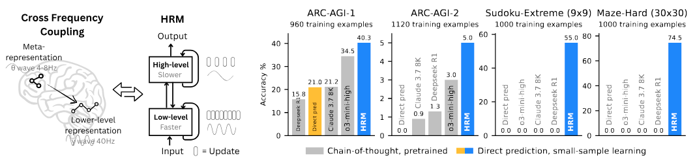

# Vision-HRM: Hierarchical Reasoning Model for Vision Tasks



This repository contains an adaptation of the **Hierarchical Reasoning Model (HRM)** for computer vision tasks, specifically image classification on CIFAR-10 and CIFAR-100 datasets.

## 🌟 Overview

The Hierarchical Reasoning Model (HRM) is a novel recurrent architecture inspired by hierarchical and multi-timescale processing in the human brain. Originally designed for complex reasoning tasks (Sudoku, mazes, ARC-AGI), this repository extends HRM to handle vision tasks using patch-based image processing.

### Key Features

- **Dual-Module Architecture**: High-level module for slow, abstract planning + Low-level module for rapid, detailed computations
- **Efficient Learning**: Achieves strong performance with minimal training data (1000 samples)
- **Vision Adaptation**: Processes images as sequences of patches similar to Vision Transformers
- **Small Model Size**: Only 27M parameters for reasoning tasks, efficiently scaled for vision tasks
- **No Pre-training Required**: Trains from scratch without massive datasets or Chain-of-Thought data

**Join our Discord Community: [https://discord.gg/sapient](https://discord.gg/sapient)**

---

## 📋 Table of Contents

- [Quick Start](#-quick-start)
- [Vision Tasks (CIFAR)](#-vision-tasks-cifar)
- [Reasoning Tasks (Original HRM)](#-reasoning-tasks-original-hrm)
- [Architecture](#-architecture)
- [Results](#-results)
- [Citation](#-citation)

---

## 🚀 Quick Start

### Prerequisites

**CUDA and PyTorch Installation:**

```bash
# Install CUDA 12.6
CUDA_URL=https://developer.download.nvidia.com/compute/cuda/12.6.3/local_installers/cuda_12.6.3_560.35.05_linux.run
wget -q --show-progress --progress=bar:force:noscroll -O cuda_installer.run $CUDA_URL
sudo sh cuda_installer.run --silent --toolkit --override
export CUDA_HOME=/usr/local/cuda-12.6

# Install PyTorch with CUDA 12.6
pip3 install torch torchvision torchaudio --index-url https://download.pytorch.org/whl/cu126

# Additional packages for building extensions
pip3 install packaging ninja wheel setuptools setuptools-scm
```

**FlashAttention Installation:**

For Hopper GPUs (H100, etc.):
```bash
git clone git@github.com:Dao-AILab/flash-attention.git
cd flash-attention/hopper
python setup.py install
```

For Ampere or earlier GPUs (A100, RTX 30/40 series):
```bash
pip3 install flash-attn
```

**Python Dependencies:**
```bash
pip install -r requirements.txt
```

**Weights & Biases (Optional but Recommended):**
```bash
wandb login
```

---

## 🖼️ Vision Tasks (CIFAR)

### Architecture Overview

The Vision-HRM adapts the original architecture for image classification:

1. **Patch Embedding**: Converts 32×32 images into 4×4 patches (64 patches total)
2. **Hierarchical Processing**: Same H-level and L-level reasoning modules
3. **Classification Head**: Uses class token for final predictions
4. **Single Forward Pass**: No adaptive computation time needed

### Training on CIFAR

**Quick Start (Convenience Script):**
```bash
# CIFAR-10
python train_cifar.py --dataset CIFAR10 --epochs 50

# CIFAR-100
python train_cifar.py --dataset CIFAR100 --epochs 100
```

**Manual Training:**
```bash
# 1. Build the dataset
python dataset/build_cifar_dataset.py --dataset-name CIFAR10

# 2. Train the model
python pretrain_vision.py --config-name cfg_vision_pretrain
```

**Custom Hyperparameters:**
```bash
python train_cifar.py --dataset CIFAR10 --epochs 50 --batch-size 128 --lr 2e-4
```

### Expected Performance

- **CIFAR-10**: ~85-90% accuracy
- **CIFAR-100**: ~60-70% accuracy

### Vision Configuration Files

- `config/arch/hrm_vision_v1.yaml` - Model architecture configuration
- `config/cfg_vision_pretrain.yaml` - Training configuration

### Dataset Format

The CIFAR dataset is converted to HRM format:
- **Images → Patches**: 32×32 images → 4×4 patches (64 patches)
- **Patches → Sequence**: Each patch → 48 values (4×4×3 RGB)
- **Sequence Length**: 3072 tokens (64 patches × 48 values)
- **Vocabulary**: 256 tokens (0-255 for pixel values)

See [README_VISION.md](README_VISION.md) for detailed vision-specific documentation.

---

## 🧩 Reasoning Tasks (Original HRM)

The original HRM excels at complex reasoning tasks without pre-training or Chain-of-Thought data.

### Quick Demo: Sudoku Solver

Train a master-level Sudoku AI on a laptop GPU:

```bash
# Download and build Sudoku dataset (1000 examples)
python dataset/build_sudoku_dataset.py \
  --output-dir data/sudoku-extreme-1k-aug-1000 \
  --subsample-size 1000 \
  --num-aug 1000

# Start training (single GPU)
OMP_NUM_THREADS=8 python pretrain.py \
  data_path=data/sudoku-extreme-1k-aug-1000 \
  epochs=20000 \
  eval_interval=2000 \
  global_batch_size=384 \
  lr=7e-5 \
  puzzle_emb_lr=7e-5 \
  weight_decay=1.0 \
  puzzle_emb_weight_decay=1.0
```

**Runtime:** ~10 hours on RTX 4070 laptop GPU

### Pre-trained Checkpoints

- [ARC-AGI-2](https://huggingface.co/sapientinc/HRM-checkpoint-ARC-2)
- [Sudoku 9×9 Extreme (1000 examples)](https://huggingface.co/sapientinc/HRM-checkpoint-sudoku-extreme)
- [Maze 30×30 Hard (1000 examples)](https://huggingface.co/sapientinc/HRM-checkpoint-maze-30x30-hard)

### Full-Scale Experiments (8-GPU Setup)

**Dataset Preparation:**
```bash
# Initialize submodules
git submodule update --init --recursive

# ARC-1 (960 examples)
python dataset/build_arc_dataset.py

# ARC-2 (1120 examples)
python dataset/build_arc_dataset.py \
  --dataset-dirs dataset/raw-data/ARC-AGI-2/data \
  --output-dir data/arc-2-aug-1000

# Sudoku-Extreme
python dataset/build_sudoku_dataset.py  # Full version
python dataset/build_sudoku_dataset.py \
  --output-dir data/sudoku-extreme-1k-aug-1000 \
  --subsample-size 1000 \
  --num-aug 1000  # 1000 examples

# Maze (1000 examples)
python dataset/build_maze_dataset.py
```

**Dataset Visualization:**
- Open `puzzle_visualizer.html` in your browser
- Upload the dataset folder from `data/...`

**Training Commands:**

ARC-1 (~24 hours):
```bash
OMP_NUM_THREADS=8 torchrun --nproc-per-node 8 pretrain.py
```

ARC-2 (~24 hours, checkpoint at 8 hours often sufficient):
```bash
OMP_NUM_THREADS=8 torchrun --nproc-per-node 8 pretrain.py \
  data_path=data/arc-2-aug-1000
```

Sudoku Extreme 1k (~10 minutes):
```bash
OMP_NUM_THREADS=8 torchrun --nproc-per-node 8 pretrain.py \
  data_path=data/sudoku-extreme-1k-aug-1000 \
  epochs=20000 \
  eval_interval=2000 \
  lr=1e-4 \
  puzzle_emb_lr=1e-4 \
  weight_decay=1.0 \
  puzzle_emb_weight_decay=1.0
```

Maze 30×30 Hard 1k (~1 hour):
```bash
OMP_NUM_THREADS=8 torchrun --nproc-per-node 8 pretrain.py \
  data_path=data/maze-30x30-hard-1k \
  epochs=20000 \
  eval_interval=2000 \
  lr=1e-4 \
  puzzle_emb_lr=1e-4 \
  weight_decay=1.0 \
  puzzle_emb_weight_decay=1.0
```

Full Sudoku-Hard (~2 hours):
```bash
OMP_NUM_THREADS=8 torchrun --nproc-per-node 8 pretrain.py \
  data_path=data/sudoku-hard-full \
  epochs=100 \
  eval_interval=10 \
  lr_min_ratio=0.1 \
  global_batch_size=2304 \
  lr=3e-4 \
  puzzle_emb_lr=3e-4 \
  weight_decay=0.1 \
  puzzle_emb_weight_decay=0.1 \
  arch.loss.loss_type=softmax_cross_entropy \
  arch.L_cycles=8 \
  arch.halt_max_steps=8 \
  arch.pos_encodings=learned
```

---

## 🏗️ Architecture

### Core Components

**High-Level Module (H-level):**
- Slow, abstract planning and reasoning
- Operates at coarse temporal resolution
- Guides overall strategy

**Low-Level Module (L-level):**
- Fast, detailed computations
- Operates at fine temporal resolution
- Executes concrete steps

**Vision Adaptations:**
- `VisionPatchEmbedding`: Converts images to patch sequences
- `VisionClassificationHead`: Classification using class token
- `VisionClassificationLossHead`: Loss computation

### Model Parameters

**Vision Configuration:**
- Hidden size: 512
- Attention heads: 8
- H/L layers: 4 each
- H/L cycles: 2 each
- Patch size: 4×4
- Classes: 10 (CIFAR-10) or 100 (CIFAR-100)

**Reasoning Configuration:**
- Parameters: ~27M
- Context-efficient compared to large language models
- Single forward pass execution

---

## 📊 Results

### Vision Tasks

| Dataset   | Accuracy | Notes                          |
|-----------|----------|--------------------------------|
| CIFAR-10  | 85-90%   | Proof-of-concept adaptation   |
| CIFAR-100 | 60-70%   | Small-scale experiments       |

### Reasoning Tasks (Original HRM)

| Task              | Performance  | Training Samples |
|-------------------|--------------|------------------|
| Sudoku Extreme    | ~100%        | 1,000            |
| Maze 30×30        | ~100%        | 1,000            |
| ARC-AGI-1         | SOTA         | 960              |
| ARC-AGI-2         | SOTA         | 1,120            |

**Key Achievement:** Outperforms much larger models with significantly longer context windows on ARC benchmark for artificial general intelligence.

---

## 📁 Repository Structure

```
Vision-HRM/
├── config/                      # Configuration files
│   ├── arch/                   # Architecture configs
│   │   ├── hrm_vision_v1.yaml # Vision model config
│   │   └── ...
│   ├── cfg_pretrain.yaml       # Reasoning training config
│   └── cfg_vision_pretrain.yaml # Vision training config
├── dataset/                     # Dataset builders
│   ├── build_cifar_dataset.py  # CIFAR dataset builder
│   ├── build_arc_dataset.py    # ARC dataset builder
│   ├── build_sudoku_dataset.py # Sudoku dataset builder
│   └── build_maze_dataset.py   # Maze dataset builder
├── models/                      # Model implementations
│   ├── hrm/
│   │   ├── hrm_vision_v1.py   # Vision HRM architecture
│   │   └── ...                # Original HRM modules
│   └── vision_losses.py       # Vision loss functions
├── utils/                       # Utility functions
├── pretrain.py                  # Reasoning task training
├── pretrain_vision.py          # Vision task training
├── train_cifar.py              # CIFAR convenience script
├── evaluate.py                 # Model evaluation
├── test_vision_pipeline.py     # Vision pipeline tests
├── puzzle_visualizer.html      # Dataset visualization tool
├── requirements.txt            # Python dependencies
├── README.md                   # This file
└── README_VISION.md            # Detailed vision documentation
```

---

## 🔧 Evaluation

### Vision Models
Check training progress in W&B or run evaluation:
```bash
python test_vision_pipeline.py
```

### Reasoning Models
Check `eval/exact_accuracy` in W&B.

For ARC-AGI evaluation:
```bash
OMP_NUM_THREADS=8 torchrun --nproc-per-node 8 evaluate.py \
  checkpoint=<CHECKPOINT_PATH>
```

Then use `arc_eval.ipynb` to finalize and inspect results.

---

## ⚠️ Important Notes

- **Small-sample learning**: Accuracy variance of ±2 points is normal
- **Sudoku-Extreme overfitting**: Use early stopping when training accuracy → 100%
- **Vision tasks**: This is a proof-of-concept; specialized architectures (ResNet, ViT) are recommended for production
- **GPU requirements**: Vision tasks can run on single GPU; reasoning tasks benefit from multi-GPU

---

## 🛠️ Troubleshooting

### CUDA out of memory
Reduce `global_batch_size` in config files

### Dataset not found
Run the appropriate dataset builder script first

### Import errors
Ensure you're in the project root directory and all dependencies are installed

### FlashAttention build issues
Check CUDA version compatibility and GPU architecture

---

## 🔮 Future Directions

### Vision Enhancements
- Multi-scale reasoning for different image resolutions
- Support for ImageNet and other large-scale datasets
- Attention visualization tools
- Advanced data augmentation strategies

### Reasoning Enhancements
- Additional puzzle types and reasoning tasks
- Transfer learning experiments
- Hybrid vision-reasoning tasks

---

## 📜 Citation

```bibtex
@misc{wang2025hierarchicalreasoningmodel,
      title={Hierarchical Reasoning Model},
      author={Guan Wang and Jin Li and Yuhao Sun and Xing Chen and Changling Liu and Yue Wu and Meng Lu and Sen Song and Yasin Abbasi Yadkori},
      year={2025},
      eprint={2506.21734},
      archivePrefix={arXiv},
      primaryClass={cs.AI},
      url={https://arxiv.org/abs/2506.21734},
}
```

---

## 📄 License

See [LICENSE](LICENSE) file for details.

---

## 🤝 Contributing

Contributions are welcome! Please feel free to submit issues or pull requests.

---

## 🔗 Links

- **Paper**: [arXiv:2506.21734](https://arxiv.org/abs/2506.21734)
- **Discord**: [https://discord.gg/sapient](https://discord.gg/sapient)
- **Checkpoints**: [Hugging Face - sapientinc](https://huggingface.co/sapientinc)

---

**Note**: This repository demonstrates HRM's versatility across both reasoning and vision domains. For detailed vision-specific information, see [README_VISION.md](README_VISION.md).
